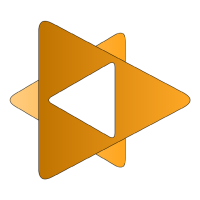
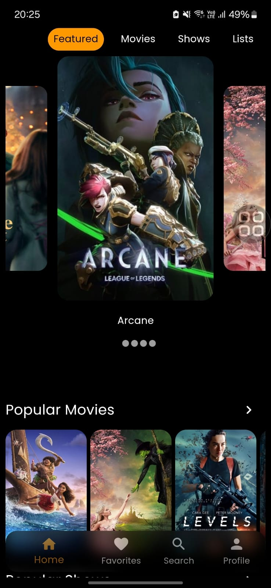
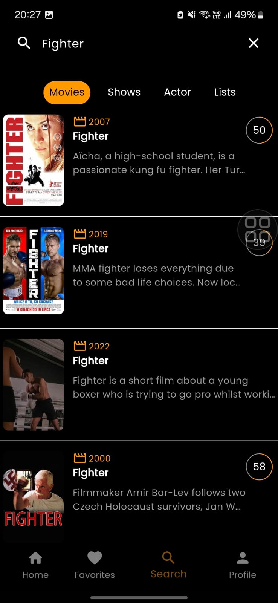
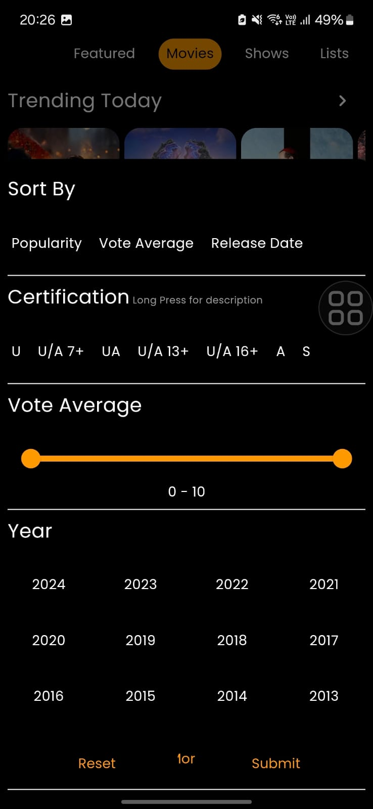
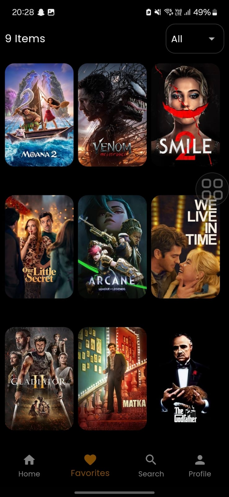
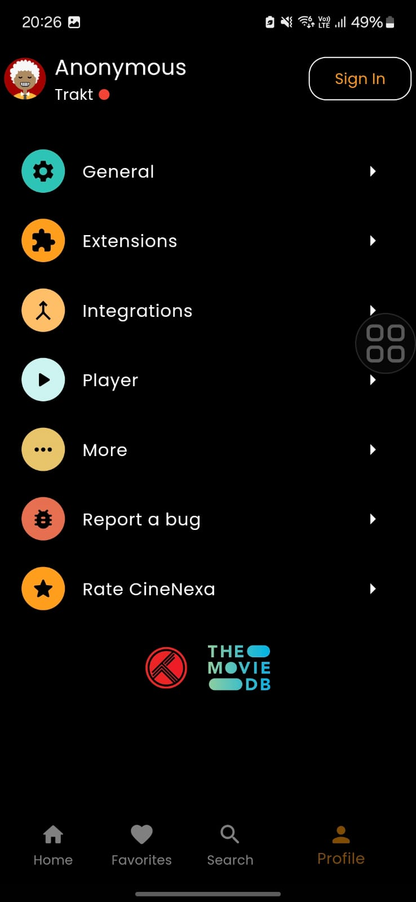
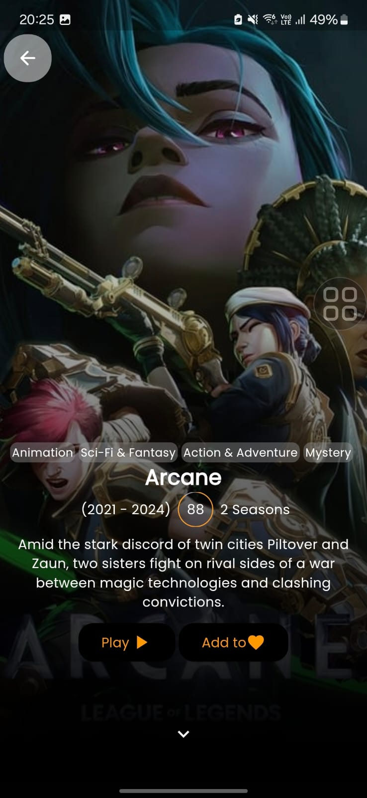
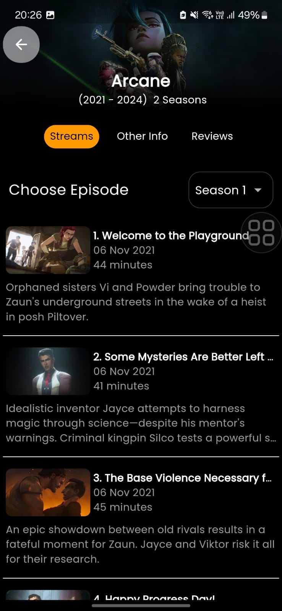

---

# 🎥 CineNexa

**Track what you see, Resume where you left.**

CineNexa is your ultimate movie and show tracker, powered by [Trakt.tv](https://trakt.tv) and [TMDB](https://www.themoviedb.org). Whether you're binge-watching your all-time favorites or exploring new content, CineNexa tracks your progress, allowing you to resume seamlessly from where you left off. With features like plugin-based extensions, clean UI, and powerful discovery tools, CineNexa enhances your viewing experience.

---

## 📸 Screenshots

Take a closer look at CineNexa's intuitive interface and powerful features:

|  |  |  |
|:-------------------------------------------------------------------:|:---------------------------------------------------------------------:|:----------------------------------------------------------------------:|
| **Home Screen**                                                    | **Search Movies**                                                     | **Discover Content**                                                   |

|  |  |  |
|:-----------------------------------------------------------------:|:-------------------------------------------------------------------:|:----------------------------------------------------------------:|
| **Favorites**                                                     | **Profile**                                                      | **Details**                                                    |

|  |
|:-------------------------------------------------------------------------:|
| **Episodes**                                                    |

---

## ✨ Features

- **🔍 Search, Filter & Discover**  
  Find new movies and shows effortlessly. Filter results to suit your preferences and discover trending content worldwide.

- **🛠️ Install Extensions & Binge**  
  Enhance CineNexa by installing third-party extensions, allowing you to access content from all over the globe.

- **⏱️ Track, Resume & Repeat**  
  Never lose track of your progress. CineNexa syncs with [Trakt.tv](https://trakt.tv) to save your viewing history and resume across devices.

- **🎨 Clean UI**  
  Enjoy an eye-pleasing interface with beautiful animations and dark mode support for a seamless browsing experience.

---

## ⚙️ Installation

### Steps
1. Go to Releases section on github.

2. Download and install the .apk file according to your device architecture.

3. Explore CineNexa's features, configure your library, and start tracking!

---

## 🎮 Usage

1. **🔍 Search and Discover:**  
   Browse and filter content by genre, popularity, or region. Discover what’s trending worldwide.

2. **⏳ Track Progress:**  
   Automatically sync your progress with Trakt.tv and access it across supported apps.

3. **📂 Library Management:**  
   Add movies and shows to your personal library for easy access.

4. **🔌 Extend Functionality:**  
   Install third-party extensions to expand your content options. Extensions can be added via the app’s plugin system.

---

## 📦 Dependencies

- **🔗 Trakt.tv API**  
  CineNexa relies on Trakt.tv for tracking and syncing user progress.

- **📊 TMDB API**  
  Content metadata (like movie/show information) is powered by TMDB.

---

## 🛠️ Configuration

### 🔄 Sync with Trakt.tv
- Log in to your Trakt.tv account within the app to enable progress syncing and tracking across devices.

### 🔌 Installing Extensions
1. Navigate to the **Extensions** section in the app.
2. Browse available plugins developed by third-party developers.
3. Install the desired extension and configure it as needed.

---

## ⚠️ Disclaimer

CineNexa uses services from Trakt.tv and TMDB but is not officially certified or endorsed by these platforms. Extensions are created by third-party developers and are not affiliated with CineNexa.

---

Start tracking your favorite movies and shows with CineNexa today! 🎥🍿
